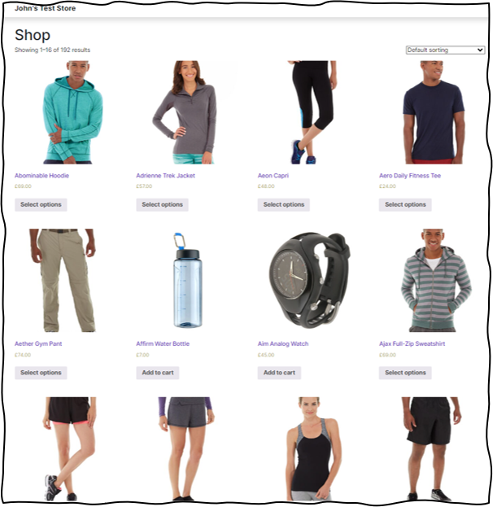
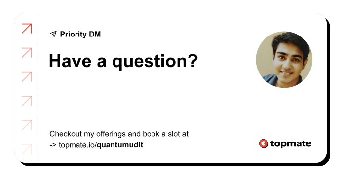

<!-- # ![Project Logo][project_logo] -->
# Test Store Data Analysis

---

<h4 align="center">Empowering users to scrape the products data from <a href="https://gopher1.extrkt.com/" target="_blank">John's Test Store</a> website. 

<!-- This web application, developed with <a href="https://www.python.org/" target="_blank">Python</a> and <a href="https://streamlit.io/" target="_blank">Streamlit</a>, streamlines the process of downloading books that match their preferences.</h4> -->

<p align='center'>


</p>


<p align="center">
  <a href="#overview">Overview</a> •
  <a href="#prerequisites">Prerequisites</a> •
  <a href="#architecture">Architecture</a> •
  <a href="#demo">Demo</a> •
  <a href="#support">Support</a> •
  <a href="#license">License</a>
</p>

## Overview

The primary goal of this project revolves around the retrieval of comprehensive products data from the [John's Test Store][website_link] website and analyze it.

<p align='center'>
  <a href="https://gopher1.extrkt.com/">
    
  </a>
</p>

<!-- The web application has been meticulously designed to cater to on-demand web scraping. In essence, it selectively extracts essential book information based on the user's specified choices regarding category, subject, and topic.

Once the user designates a category, the application promptly generates a list of associated subjects for the user to select from. Likewise, upon selecting a subject, the application dynamically populates a dropdown menu with relevant topics (if available).

<p align='center'>
  <a href="https://ebooks-extractor-app.streamlit.app/">
    
  </a>
</p>

Armed with these three choices, users can effortlessly obtain their desired information in the form of a downloadable CSV file, simply by clicking the "Get Data" button. -->

The project repository exhibits the following structure:

```
Test-Store-Data-Analysis/
├── ⚙️.env
├── 📜.gitignore
├── ⚙️.pre-commit-config.yaml
├── 🔑LICENSE
├── 🐍main.py
├── 🔒poetry.lock
├── 📇pyproject.toml
├── 📝README.md
├── 🗒️requirements.txt
├── 🐍setup.py
├── 🐍template.py
├── 📁.github
│   └── 📂workflows
│       └── 📃actions.yaml
├── 📁conf
│   └── 📃configs.yaml
├── 📁data
│   ├── 📂external
│   │   ├── 📑products_link.csv
│   │   └── 📑scraped_products.csv
│   └── 📂processed
│       └── 📑products.csv
├── 📁images
│   └── 🖼️topmate_featured.png
├── 📁logs
│   └── 🧾2024_02_04_02_44_21_PM.log
├── 📁notebooks
│   ├── 📙01_web_scraping_tests.ipynb
│   └── 📙02_data_preprocessing.ipynb
├── 📁reports
│   └── .gitkeep
└── 📁src
    ├── 🐍constants.py
    ├── 🐍exception.py
    ├── 🐍logger.py
    ├── 🐍__init__.py
    ├── 📂components
    │   ├── 🐍data_preprocessor.py
    │   ├── 🐍link_extraction.py
    │   └── 🐍product_scraper.py
    ├── 📂pipelines
    │   ├── 🐍stage_01_data_extraction.py
    │   └── 🐍stage_02_data_preprocessor.py
    └── 📂utils
        └── 🐍basic_utils.py

```
<!-- The Streamlit application is driven by two fundamental Python scripts:

- **🐍[app.py][app]**: This script capitalizes on functions from the [scraper_functions.py][scraper_funcs] file, enabling seamless web scraping. Moreover, it stands as the cornerstone of the Streamlit application.

- **🐍[scraper_functions.py][scraper_funcs]**: This file houses a collection of functions specifically designed for data extraction via web scraping techniques. -->


## Prerequisites

To fully grasp the concepts and processes involved in this project, it is recommended to have a solid understanding of the following skills:

- Fundamental knowledge of Python & Modular coding
- Familiarity with the Python libraries listed in the 🗒️[requirements.txt][requirements] file
- Basic familiarity with data analytics and Power BI

Having these skills as a foundation will help to ensure a smooth and effective experience while working on this project.

> The selection of applications and their installation process may differ depending on personal preferences and computer configurations.

## Architecture

[CONTENT TO BE ADDED]

<!-- The architectural design of this project is transparent and can be readily comprehended with the assistance of the accompanying diagram illustrated below:

![Process Architecture][process_workflow]

The project's architectural framework encompasses the following key steps:

### User Interaction

The user initiates the process by selecting their desired category from the available options.
Based on the chosen category, the web application dynamically scrapes and presents a list of related subjects for the user's selection.

Upon subject selection, the web app proceeds to scrape topics associated with the selected subject (if available).

The user can then finalize their selection by choosing "Get Data"

### Data Retrieval

Subsequently, the web application conducts a comprehensive scraping operation to gather book-related information. This gathered data is then structured into a CSV file format.

### User Output

The user is provided with a downloadable CSV file containing the acquired book data, facilitating easy access to the information they require. -->


## Demo

[CONTENT TO BE ADDED]

<!-- The following illustration demonstrates the process of collecting data by providing necessary inputs to the web application: -->

<!-- <p align='center'>
  <a href="https://ebooks-extractor-app.streamlit.app/">
    
  </a>
</p>

> Access the web application by clicking here: **[Ebooks Extractor App][webapp_link]** -->


## Support

If you have any questions, concerns, or suggestions, feel free to reach out to me through any of the following channels:

[![Linkedin Badge][linkedinbadge]][linkedin] [![Twitter Badge][twitterbadge]][twitter] [![Medium Badge][mediumbadge]][medium]


If you find my work valuable, you can show your appreciation by [buying me a coffee][buy_me_a_coffee]

<a href="https://www.buymeacoffee.com/quantumudit" target="_blank">

</a>

## License

<a href = 'https://creativecommons.org/licenses/by-nc-sa/4.0/' target="_blank">
    
</a>

This license allows reusers to distribute, remix, adapt, and build upon the material in any medium or format for noncommercial purposes only, and only so long as attribution is given to the creator. If you remix, adapt, or build upon the material, you must license the modified material under identical terms.

---
<p align='center'>
  <a href="https://topmate.io/quantumudit">
    
  </a>
</p>

---

<!-- Image Links -->

[project_logo]: ./images/ebooks_logo.png
[process_workflow]: ./images/process_workflow.png

<!-- External Links -->

[website_link]: https://gopher1.extrkt.com/
[webapp_link]: https://ebooks-extractor-app.streamlit.app/
[requirements]: ./requirements.txt


<!-- Project Specific Links -->

[app]: ./app.py
[scraper_funcs]: ./scraper_functions.py 

<!-- Profile Links -->

[linkedin]: https://www.linkedin.com/in/uditkumarchatterjee/
[twitter]: https://twitter.com/quantumudit
[medium]: https://medium.com/@quantumudit
[buy_me_a_coffee]: https://www.buymeacoffee.com/quantumudit

<!-- Shields Profile Links -->

[linkedinbadge]: https://img.shields.io/badge/-uditkumarchatterjee-0e76a8?style=flat&labelColor=0e76a8&logo=linkedin&logoColor=white
[twitterbadge]: https://img.shields.io/badge/-quantumudit-000000?style=flat&labelColor=000000&logo=x&logoColor=white&link=https://twitter.com/quantumudit
[mediumbadge]: https://img.shields.io/badge/-quantumudit-02b875?style=flat&labelColor=02b875&logo=medium&logoColor=white